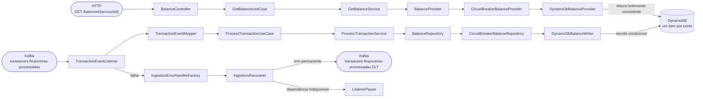
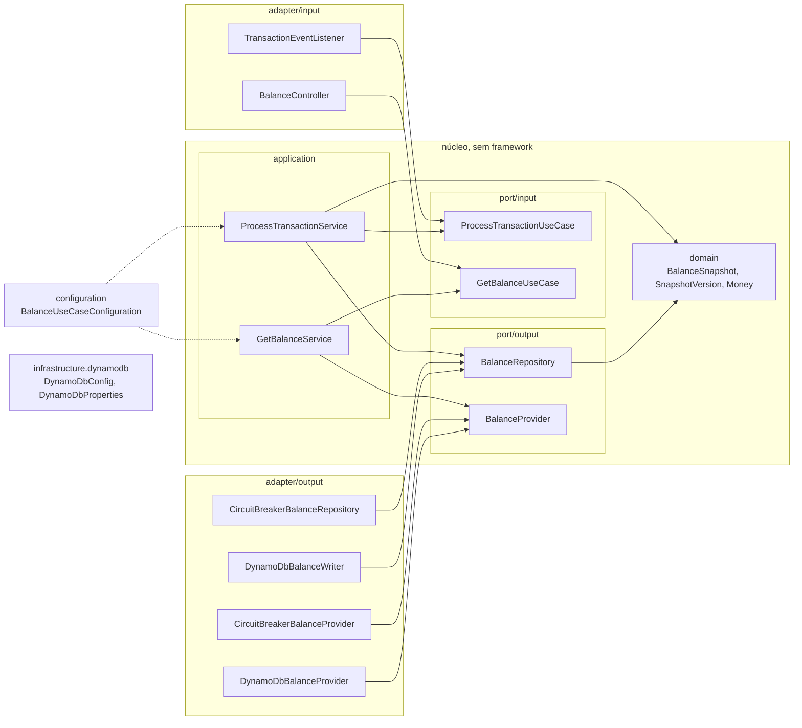

# Consulta de saldo — desafio técnico Itaú

> ## Aviso sobre os comentários no código
>
> O código desta solução tem **mais comentários do que teria em um ambiente de produção tradicional**. Lá, esses comentários não seriam mergeados: o nome dos identificadores, os testes, o histórico do git e a documentação das changes já bastariam.
>
> Eles foram **enviados no commit de propósito**, para dar visibilidade, durante a análise da solução, ao que cada mudança faz e ao que a motivou. Para não sujar o código, os comentários ficam **só no cabeçalho de cada arquivo**, em um único bloco antes do `package`, e o corpo não tem comentário. O cabeçalho traz:
>
> - uma **entrada por trecho** criado ou alterado, com a **linha** (`L<início>-L<fim>`), o símbolo e o **porquê** da implementação, em português;
> - o **item do enunciado** que motivou a mudança, na última linha, no formato `Enunciado: <seção> → <item>`, com os títulos do enunciado do desafio. O enunciado (`.challenge/enunciado.md`) não faz parte do repositório, então esses itens citam os títulos do enunciado recebido com o desafio;
> - nos arquivos de teste, também o **requisito da spec** que eles cobrem, em `Spec: <requisito>`.
>
> As decisões de design que justificam o código, e as alternativas descartadas, ficam no `design.md` de cada change em `openspec/changes/`.

## Sumário

- [Visão da solução](#visão-da-solução)
- [Como rodar](#como-rodar)
- [Decisões de arquitetura](#decisões-de-arquitetura)
- [Estratégia de testes](#estratégia-de-testes)
- [Resiliência e observabilidade](#resiliência-e-observabilidade)
- [O que eu faria com mais tempo](#o-que-eu-faria-com-mais-tempo)
- [Como o repositório foi construído](#como-o-repositório-foi-construído)
- [Variáveis de ambiente](#variáveis-de-ambiente)
- [Comandos do Makefile](#comandos-do-makefile)

## Visão da solução

O serviço ingere do Kafka (tópico `transacoes-financeiras-processadas`) as transações já processadas pelo autorizador, guarda no DynamoDB o snapshot de saldo mais recente de cada conta e o expõe em `GET /balances/{accountId}`. O saldo já vem pronto no evento, então o serviço não recalcula nada: o que ele decide é qual evento é o mais recente (maior `transaction.timestamp`, com desempate pelo maior id), por uma escrita condicional atômica que torna a ingestão idempotente e imune à ordem de chegada. Durante falhas transitórias da dependência, o consumer pausa e o Kafka guarda o backlog dentro da retenção configurada; a leitura é fortemente consistente e nunca vem de cache. Essa leitura reflete o último snapshot persistido, ainda sujeito ao atraso da ingestão.

### Fluxo



### Arquitetura hexagonal

O núcleo (`domain`, `port` e `application`) não conhece framework, banco nem broker. Todo contato com o mundo externo passa por *ports* (interfaces) implementados por *adapters*, e a dependência aponta sempre para dentro: `adapter → port ← application → domain`. Adapters acessam casos de uso pelos ports de entrada e modelos do domínio, sem importar `application` ou a configuração. Os services são Kotlin puro; o Spring os registra externamente em `BalanceUseCaseConfiguration` e `HelloUseCaseConfiguration`. A configuração compartilhada de clientes fica em `infrastructure.dynamodb`, fora dos contextos de negócio. As setas abaixo indicam "depende de"; as linhas tracejadas mostram a composição externa.



A política compartilhada pelos testes arquiteturais (incluindo `HexagonalArchitectureTest`, com [Konsist](https://github.com/LemonAppDev/konsist) e PSI Kotlin) descobre automaticamente os contextos pelas camadas dos fontes, inclusive contextos parciais: hoje `hello` e `balance`, sem lista manual. Ela rejeita frameworks em `domain`, `port` e `application`, dependência de núcleo de outro contexto, `adapter → application/configuration` e `application → adapter/configuration`, incluindo aliases e referências qualificadas. Infraestrutura e composição externas não são contextos de negócio; um escopo vazio falha. Detalhes em [enforce-hexagonal-architecture design D1, D2 e D3](openspec/changes/archive/2026-10-02-enforce-hexagonal-architecture/design.md).

### Stack

| Categoria | Tecnologia |
|-|-|
| Linguagem | Kotlin 2.3.21 |
| Runtime | Java 21 (Eclipse Temurin) |
| Framework | Spring Boot 4.1.0 (Spring Framework 7), Spring MVC |
| Build | Gradle 9.5.1 (Kotlin DSL) |
| Serialização JSON | Jackson 3 (`tools.jackson`, incluindo módulo Kotlin) |
| Banco de dados | Amazon DynamoDB (AWS SDK for Java v2) |
| Mensageria | Kafka (protocolo) via Spring Kafka; broker real = Redpanda |
| Resiliência | Resilience4j 2.4.0 (circuit breaker), `ExponentialBackOff` do Spring Framework no error handler do Spring Kafka |
| Observabilidade | Actuator, Micrometer (Prometheus), Micrometer Tracing com a ponte OpenTelemetry, log JSON nativo do Boot |
| Documentação da API | springdoc-openapi 3.1.1 (Swagger UI gerada do código) |
| Testes | JUnit, Konsist, MockMvc, kotlinx-coroutines (teste de concorrência), fakes escritos à mão para os *ports* |
| Cobertura | JaCoCo (gate mínimo de 90% de instruções) |
| Containers | Docker + Docker Compose |

O contexto `hello` (`GET /hello`, tópico `greeting-templates`, tabela `GreetingMessages`) é o exemplo que veio com o starter kit. Ele continua no repositório e não faz parte da solução, por isso não é documentado aqui.

### Mapa do critério *O que será avaliado* do enunciado

| Critério do enunciado | Onde está |
|-|-|
| Modelagem de dados no DynamoDB | `ADR-2` |
| Tratamento de concorrência | `ADR-3`, `ADR-4` e o teste de concorrência em *Estratégia de testes* |
| Resiliência | `ADR-5`, `ADR-6` e *Resiliência e observabilidade* |
| Testes | *Estratégia de testes* |
| Qualidade de código e arquitetura hexagonal | os diagramas acima, o `HexagonalArchitectureTest` e *Como o repositório foi construído* |
| Tratamento de cenários adversos (API) | tabela de status em *Como rodar*, `ADR-5`, `ADR-6` e `ADR-7` |
| Production readiness | *Resiliência e observabilidade* |
| Pattern ou algoritmo não implementado, com os motivadores | *O que eu faria com mais tempo* |

## Como rodar

**Pré-requisitos:**

- **Docker** com Docker Compose. É o único necessário para subir o ambiente e rodar `make test`.
- **make**, que já vem em Linux e macOS. No Windows, use o **WSL2**: o Makefile depende de utilitários estilo Unix e não roda direto no PowerShell nem no cmd.
- **JDK 21** só para `make integration-test` e para rodar a aplicação pela IDE (o Gradle baixa o toolchain se faltar).

### 1. Subir o ambiente

```bash
make up      # app + DynamoDB Local + Redpanda; os seeds criam as tabelas e os tópicos
make logs    # acompanha os logs da aplicação
```

A aplicação só inicia depois que os dois seeds terminam com sucesso, e o `healthcheck` do serviço `app` espera o `readiness` responder. O `make up` demora mais na primeira vez, porque o Docker baixa as imagens.

### 2. Criar o tópico

O seed do `make up` já cria o tópico `transacoes-financeiras-processadas` e a DLT `transacoes-financeiras-processadas.DLT`, com 6 partições cada (`infra/redpanda/ingestion-topics.sh`, idempotente). A criação automática de tópicos está desligada, então criar um tópico é sempre uma ação explícita. O comando do enunciado, que cria um tópico avulso, é útil para outros tópicos ou para um ambiente subido sem o seed:

```bash
make kafka-topic-create NAME=transacoes-financeiras-processadas
```

Ele cria o tópico com 1 partição; use `PARTITIONS=6` para igualar o seed (o seed lê `INGESTION_PARTITIONS`, padrão `6`). Com o ambiente já no ar, o tópico existe, e o `rpk` responde `TOPIC_ALREADY_EXISTS`: é esperado e não muda nada. O `make kafka-topics-ingestion` cria o tópico e a DLT com 6 partições cada, só os que ainda não existirem.

### 3. Gerar eventos

```bash
make kafka-produce-transactions-events TOPIC=transacoes-financeiras-processadas COUNT=50
```

O gerador cria uma conta aleatória por evento (`account.id` novo a cada mensagem), então nenhuma conta recebe um segundo evento: ele **não demonstra duplicado nem fora de ordem**. Para ver esses dois casos, publique à mão no Redpanda Console (http://localhost:8081 → tópico → *Produce Message*) o payload de exemplo do enunciado:

```json
{"transaction":{"id":"8e8ae808-b154-48b5-9f3e-553935cc4543","type":"CREDIT","amount":97.07,"currency":"BRL","status":"APPROVED","timestamp":1751641364589998},"account":{"id":"5b19c8b6-0cc4-4c72-a989-0c2ee15fa975","owner":"315e3cfe-f4af-4cd2-b298-a449e614349a","created_at":1634874339000000,"status":"ENABLED","balance":{"amount":183.12,"currency":"BRL"}}}
```

- **Duplicado:** publique o mesmo payload de novo. O saldo não muda e a métrica `balance_transactions_processed_total{result="duplicate"}` sobe.
- **Fora de ordem:** publique o mesmo payload com outro `transaction.id`, `balance.amount` diferente e um `transaction.timestamp` **menor** (por exemplo `1751641364589000`). O saldo continua o do evento de timestamp maior e a métrica `stale_ignored` sobe.

### 4. Consultar a API

```bash
curl -i http://localhost:8080/balances/5b19c8b6-0cc4-4c72-a989-0c2ee15fa975
```

```
HTTP/1.1 200
Cache-Control: no-store
Content-Type: application/json

{
  "id": "5b19c8b6-0cc4-4c72-a989-0c2ee15fa975",
  "owner": "315e3cfe-f4af-4cd2-b298-a449e614349a",
  "balance": {"amount": 183.12, "currency": "BRL"},
  "updated_at": "2025-07-04T12:02:44.589-03:00"
}
```

`updated_at` é o `transaction.timestamp` do evento que gerou o saldo, em milissegundos e no fuso `America/Sao_Paulo`. `accountId` é um UUID na forma canônica, em maiúsculas ou minúsculas.

| Status | Quando | Observação |
|-|-|-|
| `200` | A conta tem saldo | |
| `400` | `accountId` não é um UUID | |
| `404` | A conta não tem saldo (nenhum evento ingerido) | |
| `503` | DynamoDB indisponível ou circuito aberto | cabeçalho `Retry-After` (segundos) |
| `500` | Falha inesperada | sem detalhe interno no corpo |

Todo erro é `application/problem+json` (RFC 9457), com `status`, `title`, `detail`, `instance` e `traceId`. O `traceId` é o `trace-id` do cabeçalho `traceparent` (W3C Trace Context), quando válido, ou um id novo; ele também aparece em todo log da requisição. Toda resposta de `/balances/**`, de sucesso ou de erro, traz `Cache-Control: no-store`.

### Endereços

| Serviço | URL |
|-|-|
| API | http://localhost:8080 |
| Swagger UI (gerada do código) | http://localhost:8080/swagger-ui.html |
| Especificação OpenAPI | http://localhost:8080/v3/api-docs |
| Gerenciamento (probes e métricas) | http://localhost:8082/actuator/health/readiness |
| DynamoDB Admin (tabela `AccountBalances`) | http://localhost:8001 |
| Redpanda Console | http://localhost:8081 |

### Imagens Docker

| Serviço | Imagem | Finalidade |
|-|-|-|
| `app` | build local (`eclipse-temurin:21.0.12_8-jdk-noble` → `eclipse-temurin:21.0.12_8-jre-noble`) | a própria aplicação |
| `dynamodb` | `amazon/dynamodb-local:3.3.0` | DynamoDB local (modo in-memory) |
| `dynamodb-seed` | `amazon/aws-cli:2.36.8` | cria as tabelas e popula os dados iniciais |
| `dynamodb-admin` | `aaronshaf/dynamodb-admin:5.3.4` | console web para inspecionar as tabelas |
| `redpanda` | `docker.redpanda.com/redpandadata/redpanda:v26.1.14` | broker Kafka-compatível (single-node) |
| `redpanda-seed` | `docker.redpanda.com/redpandadata/redpanda:v26.1.14` | aplica a config do cluster (`config.sh`), cria os tópicos e publica as mensagens iniciais, usando `rpk` |
| `redpanda-console` | `docker.redpanda.com/redpandadata/console:v3.9.0` | console web para inspecionar tópicos e mensagens |

Todas as imagens usam versões fixas, nunca `latest`, para builds reprodutíveis. O Redpanda substitui o Apache Kafka no ambiente local por ser um binário único em C++ (sem JVM e sem ZooKeeper), com suporte ao protocolo Kafka: a aplicação usa `spring-kafka` sem nenhum código específico dele.

### Loop de desenvolvimento rápido (rodando pela IDE)

Para depurar com breakpoints e sem reconstruir a imagem a cada mudança, suba só a infraestrutura e rode a aplicação pela IDE:

```bash
make db-up       # DynamoDB Local + console web
make kafka-up    # Redpanda + console web
```

Esses comandos retornam quando os containers **sobem**, não quando os seeds **terminam**: espere alguns segundos antes de rodar `Application.kt` (ou `./gradlew bootRun`). Os valores padrão do `application.yaml` (`localhost:8000` e `localhost:19092`) já apontam para essas portas.

### Solução de problemas

- **Primeiro `make up` demorando:** o Docker baixa as imagens do compose e as imagens base do build. Acompanhe com `make logs`; só desconfie se não houver progresso por vários minutos.
- **Erro `port is already allocated` ou `address already in use`:** a stack ocupa `8080` (API), `8082` (gerenciamento), `8000` e `8001` (DynamoDB), `8081` (Redpanda Console) e `19092` (Redpanda). Libere a porta em conflito ou pare a outra stack.
- **Algo travado ou inconsistente:** `make clean-containers` remove todos os containers do projeto, incluindo órfãos, para recomeçar do zero.

## Decisões de arquitetura

Cada decisão está em formato de ADR curto: **Contexto**, **Decisão** e **Consequência**. A discussão completa, com as alternativas descartadas e os riscos, está no `design.md` da change citada em **Detalhe**.

### ADR-1. Snapshot por conta em vez de recalcular o saldo

- **Contexto:** Cada evento do autorizador, aprovado ou rejeitado, já traz o saldo atual da conta (`account.balance`). O desafio pede o saldo mais recente, não o extrato.
- **Decisão:** Guardar um item por conta com o último snapshot, e nunca recalcular: o saldo do evento é mantido como veio, inclusive o de um evento `DECLINED`, que só avança `updated_at`. "Mais recente" é o maior `transaction.timestamp` (em µs), não a ordem de chegada, e `updated_at` é o `transaction.timestamp` do evento que gerou o snapshot, não o instante da gravação. Uma tabela de histórico (um item por evento) foi descartada.
- **Consequência:** A leitura é O(1) e a tabela cresce com o número de contas, não com o de eventos. Sem histórico, o tópico Kafka é o log e o autorizador é o sistema de registro; o snapshot pode ser reconstruído reprocessando os eventos ainda disponíveis no tópico, porque a escrita é idempotente e ordenada pela versão. Retenção ou perda do armazenamento do broker podem exigir outra fonte para reconstrução. O resultado depende do relógio do autorizador (ver *O que eu faria com mais tempo*).
- **Detalhe:** [add-balance-repository design D6 e D8](openspec/changes/archive/2026-09-30-add-balance-repository/design.md); [add-balance-concurrency-test design D3](openspec/changes/archive/2026-09-30-add-balance-concurrency-test/design.md); [add-transaction-ingestion design D1](openspec/changes/archive/2026-10-01-add-transaction-ingestion/design.md).

### ADR-2. Modelagem no DynamoDB

- **Contexto:** Existe um único padrão de acesso, tanto na escrita quanto na leitura: dado um `accountId`, obter ou substituir o snapshot atual.
- **Decisão:** Tabela `AccountBalances` (`PAY_PER_REQUEST`) com chave de partição `accountId` (String, UUID em minúsculas), sem chave de ordenação e sem índice secundário. Os atributos são `ownerId`, `balanceAmount` (N), `balanceCurrency`, `lastEventTimestamp` (N, em µs) e `lastTransactionId`. Escrita e leitura são um `PutItem` e um `GetItem` pela chave. O mapeamento é feito à mão (`BalanceItem`), e não pelo Enhanced Client.
- **Consequência:** Estimativa de 1 WCU por escrita e 1 RCU por leitura fortemente consistente, com item bem abaixo de 1 KB; não é uma medição de capacidade sob carga. Sem GSI, não há custo dobrado de escrita nem leitura eventual. O saldo é `BigDecimal` com a escala da moeda e pode ser negativo (cheque especial). O risco é a conta quente: todas as escritas dela caem num só item e numa só partição (limite de ~1.000 WCU/s), e uma escrita rejeitada pela condição também consome WCU. O Enhanced Client exigiria conversores para os *value objects* e a condição seguiria manual, então não pagou o custo.
- **Detalhe:** [add-balance-repository design D1 e D9](openspec/changes/archive/2026-09-30-add-balance-repository/design.md).

### ADR-3. Escrita condicional pela versão do snapshot

- **Contexto:** Várias instâncias consomem em paralelo, e o Kafka entrega fora de ordem e em duplicidade. Ler, comparar e gravar na aplicação deixa uma janela de corrida: duas instâncias leem o mesmo valor e a última a gravar vence, mesmo sendo a mais antiga.
- **Decisão:** `SnapshotVersion` (`timestamp` e id da transação) é a única definição de "mais recente", no domínio: vence o maior `timestamp` e, em empate, o maior id da transação em texto minúsculo (e não `UUID.compareTo`, que compara `long` com sinal e discorda da ordem de bytes do DynamoDB). O adapter a traduz num único `PutItem` com `ConditionExpression`: `attribute_not_exists(accountId) OR lastEventTimestamp < :t OR (lastEventTimestamp = :t AND lastTransactionId < :id)`. A comparação é estrita, então um reenvio não é "mais novo". `ConditionalCheckFailed` não é erro: vira um `SnapshotSaveResult` (`Applied`, `StaleIgnored` ou `DuplicateIgnored`), e o item que bloqueou a escrita (`ReturnValuesOnConditionCheckFailure`) distingue duplicado de mais antigo, sem leitura extra.
- **Consequência:** A decisão é atômica, em uma ida ao banco, e a idempotência sai da própria condição, sem tabela de deduplicação. Foram descartados o bloqueio otimista por `version` (duas idas por evento e ordena por chegada, não por tempo do evento) e o `TransactWriteItems` (é para vários itens e custa o dobro de WCU). Como a ordem tem duas representações (`compareTo` no domínio e a condição no adapter), um teste de integração em matriz as mantém de acordo, e um teste de concorrência com 32 escritas embaralhadas sobre a mesma conta confirma que o resultado final é a maior versão (o teste foi visto falhar quando a condição era trocada por uma escrita incondicional).
- **Detalhe:** [add-balance-repository design D2 e D3](openspec/changes/archive/2026-09-30-add-balance-repository/design.md); [add-balance-concurrency-test design D1 e D3](openspec/changes/archive/2026-09-30-add-balance-concurrency-test/design.md); [add-observability design D6](openspec/changes/archive/2026-10-01-add-observability/design.md).

### ADR-4. At-least-once com escrita idempotente

- **Contexto:** O offset só pode avançar depois de o efeito estar no DynamoDB. Um crash entre gravar e confirmar faz o broker reentregar o registro.
- **Decisão:** `AckMode.MANUAL_IMMEDIATE` num container dedicado (grupo `balance-transaction-ingestion`, `enable.auto.commit=false`, `auto-offset-reset=earliest`): o offset é confirmado depois do `saveIfNewer`, ou depois que a DLT aceitou o registro. A reentrega é ignorada pela condição do `ADR-3`: `DuplicateIgnored` quando sua versão é igual à atual, ou `StaleIgnored` quando outro evento mais novo já substituiu o snapshot. Foram descartados o *exactly-once* do Kafka (o destino é o DynamoDB, fora da transação do Kafka, então não há garantia a mais e há custo de coordenador e latência), o *at-most-once* (confirmar antes de gravar perde evento num crash) e uma tabela de deduplicação (a condição já basta).
- **Consequência:** Cada evento tem um único efeito observável, mesmo entregue mais de uma vez. Num rebalance não há estado em memória: os registros ainda não confirmados podem ser reentregues ao novo dono, e a condição evita que substituam um snapshot igual ou mais novo. No encerramento, o consumer termina o registro em andamento e sai do grupo. O paralelismo máximo é o número de partições (6, uma estimativa de 600 a 1.200 msg/s que falta validar sob carga).
- **Detalhe:** [add-transaction-ingestion design D2, D7, D8 e D9](openspec/changes/archive/2026-10-01-add-transaction-ingestion/design.md).

### ADR-5. DLT ou pausa: o que fazer com o registro que falhou

- **Contexto:** Um registro falha por culpa da mensagem (dado inválido) ou da dependência (DynamoDB fora). Tratar os dois do mesmo jeito ou trava a partição com uma mensagem que nunca vai passar, ou esvazia o fluxo bom numa fila que ninguém reprocessa.
- **Decisão:** A DLT `transacoes-financeiras-processadas.DLT` recebe **só erro permanente** (JSON inválido, campo inválido, falha permanente do armazenamento), com os headers do motivo, e o offset é confirmado. O erro transitório é repetido com backoff exponencial e jitter e **nunca** vai para a DLT. Se a dependência continua fora (circuito aberto ou tentativas esgotadas), o consumer **pausa** as partições por 30 s, sem confirmar o offset nem publicar na DLT, e retoma de onde parou: o primeiro registro reentregue é a sonda do circuito.
- **Consequência:** "DLT" sempre significa "dado ruim, veja o motivo". Durante a indisponibilidade o Kafka é o buffer durável, e o lag que cresce no broker é o sinal. Descartar o registro perderia evento (o último de uma conta inativa deixaria o saldo errado para sempre), e seguir consumindo queimaria os retries contra uma dependência morta. A DLT não é reprocessada automaticamente: republicar o payload no tópico de origem é seguro, pelo `ADR-3`. Um erro permanente de configuração, como uma tabela inexistente, pode inundar a DLT sem perder registro.
- **Detalhe:** [add-transaction-ingestion design D4, D5 e D6, e riscos R2 e R3](openspec/changes/archive/2026-10-01-add-transaction-ingestion/design.md).

### ADR-6. Leitura com ConsistentRead

- **Contexto:** Uma consulta logo depois da ingestão podia ler de uma réplica atrasada e devolver o saldo anterior à transação do cliente, o erro mais visível num core banking.
- **Decisão:** `GetItem` com `ConsistentRead=true` (nunca `Scan` nem `Query`), por um cliente DynamoDB de leitura próprio, com timeouts curtos (orçamento de 800 ms, no máximo 1 retry) e um circuit breaker próprio, separado do da escrita. Assim uma rajada de consultas lentas não pausa a ingestão, nem o contrário.
- **Consequência:** A leitura forte custa 1 RCU contra 0,5 da eventual. É a escolha por consistência: numa partição de rede a leitura forte pode falhar onde a eventual responderia, e a API degrada essa falha para `503` com `Retry-After`. O limite honesto é que o atraso dominante é o lag do consumer, que leitura forte não corrige. A leitura forte também não vale em índice secundário (não há) nem em Global Tables, e o DAX não a serve do cache.
- **Detalhe:** [add-balance-repository design D4](openspec/changes/archive/2026-09-30-add-balance-repository/design.md); [add-balance-query-api design D6, D7 e D8](openspec/changes/archive/2026-10-01-add-balance-query-api/design.md).

### ADR-7. Sem cache de saldo

- **Contexto:** O requisito é o saldo mais atual. Qualquer cache, mesmo com TTL curto, reintroduz leitura velha e anula a leitura forte do `ADR-6`.
- **Decisão:** Nenhum cache de saldo, local ou distribuído. Toda resposta de `/balances/**` leva `Cache-Control: no-store`, aplicado por um `NoStoreFilter`. Um filtro, e não o interceptor pronto do Spring, porque o interceptor só roda quando existe handler: um `405` ou uma rota inexistente ficariam sem o cabeçalho e poderiam ser guardados por um intermediário.
- **Consequência:** Cada consulta é um `GetItem` pela chave, barato o bastante para dispensar cache. Foram descartados o cache local com TTL (cada instância teria a sua janela de inconsistência), o DAX (a leitura forte passa direto por ele) e o `ETag` (a leitura ao DynamoDB acontece de qualquer forma). Se a leitura virar o gargalo medido, o caminho é um cache com invalidação por evento, com a regra de consistência declarada no contrato.
- **Detalhe:** [add-balance-query-api design D8](openspec/changes/archive/2026-10-01-add-balance-query-api/design.md).

### Ambiguidades do enunciado

O enunciado deixa estas questões em aberto. Cada uma foi decidida e justificada no `design.md` da change de origem.

| Ambiguidade | Decisão | Origem |
|-|-|-|
| Rota no singular ou no plural | `GET /balances/{accountId}`, no plural, como no exemplo do enunciado | `add-balance-query-api` D2 |
| `updated_at` vem do `timestamp` ou do momento da persistência | `updated_at` é o `transaction.timestamp` do evento que gerou o snapshot | `add-balance-repository` D8 |
| Status HTTP de conta inexistente e de id inválido | `404` para conta sem snapshot e `400` para `accountId` que não é UUID | `add-balance-query-api` D3 |
| Evento rejeitado (`DECLINED`) atualiza o snapshot | Sim, pela mesma regra de versão; só `updated_at` avança, porque o saldo do evento é o anterior | `add-transaction-ingestion` D1 |
| Empate de `timestamp` entre eventos da mesma conta | Vence o maior id de transação, em texto minúsculo (empate arbitrário, mas determinístico) | `add-balance-repository` D2 |

## Estratégia de testes

Todo cenário das specs de `openspec/specs/` virou teste **antes** do código (TDD), e os testes seguem as mesmas regras de qualidade do código de produção.

| Nível | Onde | Infraestrutura | Roda com | O que prova |
|-|-|-|-|-|
| Unitário | `src/test` | nenhuma | `./gradlew check` (ou `make test`, dentro de um container) | domínio, casos de uso com fakes, contrato HTTP com MockMvc, tradução de erros do SDK contra um servidor HTTP local, circuit breaker, arquitetura (Konsist) e arquivos de infraestrutura e documentação |
| Integração e ponta a ponta | `src/integrationTest` | DynamoDB Local e Redpanda reais | `make integration-test` | a condicional no DynamoDB real, a ingestão com DLT e pausa, o fluxo Kafka → DynamoDB → HTTP e a concorrência |

Os testes de integração ficam fora do `check` de propósito, para o pipeline padrão não exigir infraestrutura. O CI roda os dois níveis.

### Cenários cobertos

| Cenário do enunciado | Teste unitário | Teste de integração |
|-|-|-|
| Evento duplicado | `DynamoDbBalanceWriterTest`, `ProcessTransactionServiceTest` | `DynamoDbBalanceIntegrationTest`, `IngestionMetricsIntegrationTest` |
| Evento fora de ordem | `SnapshotVersionTest`, `SnapshotSaveResultTest` | `DynamoDbBalanceIntegrationTest`, `BalanceQueryEndToEndIntegrationTest` |
| Conta inexistente | `GetBalanceServiceTest`, `BalanceControllerTest` | `BalanceQueryEndToEndIntegrationTest` |
| Concorrência | | `DynamoDbBalanceIntegrationTest` |
| Dependência indisponível | `CircuitBreakerBalanceRepositoryTest`, `BalanceControllerTest` | `BalanceQueryDependencyUnavailableIntegrationTest`, `TransactionIngestionPauseIntegrationTest` |
| Mensagem inválida | `TransactionEventMapperTest`, `IngestionRecovererTest` | `TransactionIngestionIntegrationTest` |
| Identificador de conta inválido | `AccountIdParserTest`, `BalanceControllerTest` | `BalanceQueryEndToEndIntegrationTest` |

O teste de concorrência (`DynamoDbBalanceIntegrationTest`) dispara 32 escritas da mesma conta, embaralhadas, em coroutines no `Dispatchers.IO` liberadas ao mesmo tempo por um `CompletableDeferred`, e confere que o item final tem a maior versão. O fluxo completo está em dois testes: `TransactionIngestionEndToEndIntegrationTest` publica no Redpanda, espera a ingestão e lê o snapshot no DynamoDB pelo `BalanceProvider`, e `BalanceQueryEndToEndIntegrationTest` faz o mesmo e consulta por HTTP real. O `ReadmeTest` impede este documento de citar comando, variável ou classe que não existe.

### Cobertura

O JaCoCo exige **90% de cobertura de instruções**, e o `./gradlew check` falha se o gate não for atingido. O resumo (instruções, branches, linhas, complexidade, métodos e classes, com o veredito do gate) é impresso no próprio output do Gradle. O relatório HTML completo fica em `build/reports/jacoco/test/html/index.html` depois de `./gradlew test` ou `./gradlew check`.

Os testes que leem o repositório declaram documentos, OpenSpec, infraestrutura, HTTP e inventários de fontes (incluindo integração) como inputs do Gradle. Edições, criação, rename ou remoção invalidam a verificação; sem mudanças, `UP-TO-DATE` é esperado. No Docker, o estágio `test` recebe esses arquivos por `COPY` seletivo; builder e runtime ficam separados. Um build que reutiliza a camada de testes não é evidência de uma nova execução. Detalhes em [enforce-hexagonal-architecture design D4 e D5](openspec/changes/archive/2026-10-02-enforce-hexagonal-architecture/design.md).

## Resiliência e observabilidade

### O que existe

| Mecanismo | Como funciona | Configuração |
|-|-|-|
| Circuit breaker de escrita e de leitura | Duas instâncias independentes, `balance-storage` (a escrita, cuja abertura pausa a ingestão) e `balance-storage-read` (a consulta). Só falha transitória conta; falha permanente e "conta inexistente" não | `BALANCE_CB_*` (abre com 50% de falhas numa janela de 10 chamadas, espera 30 s, 3 sondas) |
| Cliente de escrita | Timeouts de 500 ms (conexão), 1 s (socket e tentativa) e 3 s (chamada), 3 tentativas | `DYNAMODB_*` |
| Cliente de leitura | Timeouts de 200 ms, 300 ms e 300 ms por tentativa, 800 ms no total, no máximo 2 tentativas (1 retry); a subida falha se a configuração passar disso | `DYNAMODB_READ_*` |
| Retry da ingestão | Só erro transitório: 3 retries, backoff exponencial de 200 ms (×2, até 2 s) com jitter de 100 ms | `INGESTION_*` |
| DLT | Só erro permanente, com os headers do motivo e da origem e o `traceparent` preservado | `TRANSACTIONS_DLT_TOPIC` |
| Pausa e retomada | Com a dependência fora, o consumer pausa as partições e retoma sozinho depois de 30 s | `INGESTION_PAUSE_DURATION` |
| `503` na API | Falha transitória ou circuito aberto vira `503` com `Retry-After` e `problem+json`; o circuito aberto falha em milissegundos | `BALANCE_API_RETRY_AFTER` |
| Encerramento gracioso | O `readiness` recusa tráfego, as requisições terminam e o consumer termina o registro em andamento, dentro de `stop_grace_period` (40 s, maior que os 30 s do encerramento) | `spring.lifecycle.timeout-per-shutdown-phase` |

### Probes

As probes ficam na porta de gerenciamento `8082`, separada da API. Só `health` e `prometheus` estão expostos.

| Probe | URL | Olha para |
|-|-|-|
| liveness | `/actuator/health/liveness` | só o processo vivo |
| readiness | `/actuator/health/readiness` | só o estado da aplicação (vira `503` ao começar o encerramento) |

O `readiness` **não depende** do DynamoDB nem do Kafka, de propósito, porque todas as instâncias dividem a mesma dependência, então verificá-la tiraria todas do balanceador ao mesmo tempo, trocando a resposta controlada (`503` com `Retry-After`, circuito aberto falhando em milissegundos) por recusa de conexão. A indisponibilidade aparece na métrica do circuito. Justificativa completa em [add-observability design D7](openspec/changes/archive/2026-10-01-add-observability/design.md).

### Logs e dados sensíveis

Os logs são JSON de uma linha no console (formato `logstash` do Spring Boot), com `traceId` em todo log escrito durante uma requisição HTTP ou o processamento de um registro do Kafka. O `traceId` vem do `traceparent` (W3C Trace Context), no HTTP e no header do registro, ou é gerado se não vier; é o único id de correlação, e é o mesmo do corpo de erro `problem+json`. O `owner` e o payload do evento nunca vão para log, e o `accountId` sai mascarado (só o primeiro grupo do UUID, por exemplo `AccountId(5b19c8b6)`), por construção no `toString` dos *value objects*.

### Métricas para olhar

Em `/actuator/prometheus`, na porta `8082`:

```bash
curl -s http://localhost:8082/actuator/prometheus | grep -E '^(balance_transactions_processed_total|resilience4j_circuitbreaker_state)'
```

| Métrica | O que indica |
|-|-|
| `balance_transactions_processed_total{result}` | Eventos por desfecho final: `applied`, `stale_ignored` (mais antigo que o guardado), `duplicate` (o mesmo evento de novo) e `dlq`. `dlq` maior que zero é dado ruim; `stale_ignored` alto aponta ordem ou relógio do autorizador; `duplicate` alto aponta reentrega |
| `spring_kafka_listener_seconds{spring_kafka_listener_id}` | Latência de processamento por registro, inclusive nas falhas. Filtre por `spring_kafka_listener_id="balance-transaction-ingestion-0"`: a série sem essa tag é a do listener do exemplo `hello` |
| `kafka_consumer_fetch_manager_records_lag_max{client_id,...}` | Família de lag máximo do consumer. O exportador desta stack também pode incluir `partition` e retornar `NaN`, sem amostra agregada válida. O lag por partição está em `kafka_consumer_fetch_manager_records_lag{client_id,partition}`. Mede a busca, não o processamento: com as partições pausadas ele pode ficar parado ou em 0 (com o DynamoDB fora, marcou 0 enquanto o lag real do broker era 30), então use o estado do circuito |
| `resilience4j_circuitbreaker_state{name,state}` | Estado dos circuitos `balance-storage` e `balance-storage-read`. Circuito aberto é dependência fora, e é o sinal que vale quando o lag estaciona |
| `http_server_requests_seconds_*{status,uri,method}` | Latência e contagem das requisições por status, com a rota em padrão (`/balances/{accountId}`) |

Nenhuma métrica leva `accountId`, `owner` ou `transactionId` como tag, para a cardinalidade ficar baixa. Prometheus, Grafana e alertas não fazem parte do kit; o que ficou de fora está em *O que eu faria com mais tempo*.

### Contêiner

O DynamoDB Local roda em memória: recriar ou reiniciar seu processo perde os snapshots locais, e o seed só repõe os dados de exemplo do `hello`. Esse ambiente de desenvolvimento não oferece durabilidade de produção. A retenção e o armazenamento do Kafka também limitam o backlog e o reprocessamento.

Imagem multi-stage com versões fixas, processo como usuário não root (UID `10001`), flags de memória da JVM para contêiner (`JAVA_TOOL_OPTIONS`) e `ENTRYPOINT` em forma exec, para o `SIGTERM` chegar à JVM e acionar o encerramento gracioso.

## O que eu faria com mais tempo

Tudo abaixo está fora do escopo de propósito, e cada item tem o motivador e a decisão em que a lacuna foi declarada.

| Item | Motivador | Origem |
|-|-|-|
| Número de sequência por conta emitido pelo autorizador | Relógio físico não dá causalidade: um relógio atrasado faz um evento novo virar `StaleIgnored`, e o desempate por id é arbitrário. A sequência elimina os dois problemas | `add-balance-repository` Riscos (relógio do autorizador); `add-balance-concurrency-test` Riscos (relógio do autorizador) |
| Rejeitar `transaction.timestamp` no futuro além de uma tolerância | Um relógio adiantado "congela" a conta até o tempo real alcançar aquele instante | `add-balance-repository` Riscos (relógio do autorizador) |
| Reprocessamento da DLT, com um comando ou automático | Hoje um evento ruim só volta ao fluxo por ação humana (republicar no tópico de origem, seguro pela idempotência) | `add-transaction-ingestion` R3 |
| Partições validadas sob carga | As 6 partições e os 600 a 1.200 msg/s são estimativa (100 a 200 msg/s por thread), não medição. Partições crescem, mas nunca diminuem | `add-transaction-ingestion` D7 |
| Coalescer escritas por conta dentro de um lote do Kafka | Uma conta quente concentra escrita num item e numa partição; juntar escritas reduziria o custo sem mudar a semântica | `add-balance-repository` Riscos (hot partition) |
| Tabela de histórico com `TransactWriteItems` | Só se o histórico precisar ser guardado junto do snapshot (auditoria); hoje o tópico é o log | `add-balance-repository` D6; `add-balance-concurrency-test` D3 |
| Cache de leitura com invalidação por evento, ou DAX para leituras tolerantes | Só se a leitura virar o gargalo medido, com a regra de consistência declarada no contrato | `add-balance-query-api` D8 |
| Retry não bloqueante (`@RetryableTopic`) | Resolve o bloqueio de partição por mensagem, que a DLT já cobre; para falha de dependência empilharia eventos e multiplicaria tópicos | `add-transaction-ingestion` D5 |
| Exactly-once do Kafka | O destino é o DynamoDB, fora da transação do Kafka: custaria coordenador e latência sem garantia a mais | `add-transaction-ingestion` D2 |
| Gauge de lag por `AdminClient` | A métrica do cliente fica parada com as partições pausadas (medido: lag do broker 30, métrica 0); o estado do circuito é o sinal provisório | `add-observability` D5 |
| Exportação de traces e um coletor (OTLP) | Hoje só se gera e propaga o `traceId`, sem exportador: Prometheus, Grafana e o coletor OTLP não fazem parte do kit do desafio, então não há para onde enviar os traces | `add-observability` Non-Goals e D2 |
| Alertas, dashboards e SLOs | As métricas existem, mas Prometheus e Grafana não estão no kit, então ninguém é avisado | `add-observability` D5 |
| Autenticação, autorização e rate limiting na API e no endpoint de gerenciamento | Fora do escopo do desafio: assume-se serviço interno atrás de um gateway, e o gerenciamento só é protegido por estar em outra porta | `add-balance-query-api` Non-Goals e R8; `add-observability` R7 |
| `Retry-After` calculado pelo tempo restante do circuito | Hoje é um valor fixo; o Resilience4j não expõe esse tempo de forma estável | `add-balance-query-api` D4 |
| `DnsResolver` com timeout no cliente HTTP do SDK | A resolução de DNS fica fora do orçamento de latência: com o container parado a primeira consulta levou 7,85 s para dar `503`, contra 800 ms de orçamento | `add-observability` R10 |
| Tabela de produção por IaC, com recuperação em ponto no tempo | Fora do escopo do desafio; o seed local cria a tabela só para o ambiente de desenvolvimento | `add-balance-repository` Migration Plan (produção) |
| Gerador de eventos que reutilize contas | Hoje cada evento usa uma conta nova, então o gerador não demonstra duplicado nem fora de ordem | *Como rodar* |
| Imagem com jar em camadas | A imagem é reconstruída por inteiro a cada mudança, o que é aceitável hoje | `add-observability` D8 |

## Como o repositório foi construído

O repositório foi construído com **Spec-Driven Development** sobre o [OpenSpec](https://github.com/Fission-AI/OpenSpec): primeiro se escreve o que o sistema deve fazer, em requisitos com cenários, e só depois o código, que nasce dos testes desses cenários. A pasta `openspec/` guarda tudo isso:

| Caminho | Papel |
|-|-|
| `openspec/project.md` | O contexto completo do projeto (stack, arquitetura, convenções, comandos, domínio e critérios de avaliação), a fonte de verdade para humanos e agentes |
| `openspec/config.yaml` | A versão condensada do mesmo contexto (`context:`) e as regras por artefato; o OpenSpec a injeta em toda proposta, design, spec e task. Os dois arquivos são mantidos em sincronia |
| `openspec/specs/` | O que o sistema faz hoje: uma pasta por capacidade, com requisitos e cenários `WHEN`/`THEN` |
| `openspec/changes/` | As mudanças em andamento |
| `openspec/changes/archive/` | As mudanças concluídas, com `proposal.md`, `design.md`, as specs delta, `tasks.md` e, quando houve, os relatórios de revisão |

Cada mudança percorre o mesmo ciclo: **proposal** (por quê), **design** (decisões com alternativas descartadas, riscos e as ambiguidades do enunciado resolvidas), **specs** (requisitos e cenários), **tasks** (lista test-first), **apply** (implementação) e **archive** (os deltas viram `openspec/specs/`). Histórico das changes, na ordem:

| Change | O que entregou |
|-|-|
| `add-balance-repository` | O snapshot de saldo e a escrita condicional no DynamoDB |
| `add-balance-concurrency-test` | O teste de concorrência com coroutines em paralelo |
| `add-transaction-ingestion` | O consumer Kafka com DLT, retry, pausa e circuit breaker |
| `add-balance-query-api` | `GET /balances/{accountId}`, o erro `problem+json`, a leitura resiliente e o OpenAPI |
| `add-observability` | Logs estruturados, `traceId`, métricas, probes e o contêiner |
| `enforce-hexagonal-architecture` | Núcleo puro, composição externa, infraestrutura neutra e verificação Gradle/Docker |
| `add-architecture-docs` | Este README e o `ReadmeTest` que o protege |

As regras de trabalho estão em [`CLAUDE.md`](CLAUDE.md), que funciona como uma constituição de qualidade de código: Clean Architecture, SOLID, Clean Code, DRY/KISS/YAGNI, design patterns e a regra de não reinventar a roda, comentários só no cabeçalho do arquivo, e a conformidade com o enunciado, validada item por item (ver a seção *O que será avaliado* do `enunciado.md`). Três regras moldam o histórico do git:

- **TDD:** todo cenário das specs vira teste antes do código de produção.
- **Revisão independente:** nenhuma implementação é commitada sem a revisão de outro agente, de contexto limpo e somente leitura, em até 3 rodadas.
- **Um commit por change**, em Conventional Commits com a mensagem em português (`feat(balance): ...`), reunindo implementação, testes, specs, contexto motivado pela mudança e seu arquivo no OpenSpec. Alterações pendentes de outros escopos podem permanecer na árvore de trabalho e são separadas no stage.

O contexto completo do projeto está em [`openspec/project.md`](openspec/project.md).

## Variáveis de ambiente

Todas têm valor padrão para desenvolvimento local (fora do Docker Compose) e são sobrescritas dentro do `docker-compose.yml` para apontar para os hostnames internos dos containers.

| Variável | Padrão (local) | Descrição |
|-|-|-|
| `DYNAMODB_ENDPOINT` | `http://localhost:8000` | endpoint do DynamoDB |
| `AWS_ACCESS_KEY_ID`, `AWS_SECRET_ACCESS_KEY` | (obrigatórias) | credenciais AWS, lidas pela cadeia padrão do SDK; no ambiente local, `local` e `local` (o compose, o Gradle `test` e `bootRun` já as definem). Fora do Gradle, exporte as duas antes de rodar `Application.kt` |
| `DYNAMODB_REGION` | `us-east-1` | região (fake, para o SDK) |
| `BALANCE_TABLE_NAME` | `AccountBalances` | tabela do snapshot de saldo |
| `GREETING_TABLE_NAME` | `GreetingMessages` | tabela do exemplo `hello` |
| `DYNAMODB_CONNECTION_TIMEOUT` | `500ms` | timeout de conexão do cliente de escrita |
| `DYNAMODB_SOCKET_TIMEOUT` | `1s` | timeout de socket do cliente de escrita |
| `DYNAMODB_API_CALL_ATTEMPT_TIMEOUT` | `1s` | timeout de cada tentativa da escrita |
| `DYNAMODB_API_CALL_TIMEOUT` | `3s` | timeout da escrita inteira |
| `DYNAMODB_MAX_ATTEMPTS` | `3` | tentativas do cliente de escrita |
| `KAFKA_BOOTSTRAP_SERVERS` | `localhost:19092` | broker Kafka/Redpanda |
| `KAFKA_CONSUMER_GROUP_ID` | `hello-greeting-template-consumer` | group id do consumer do exemplo `hello` |
| `GREETING_TEMPLATES_TOPIC` | `greeting-templates` | tópico do exemplo `hello` |
| `TRANSACTIONS_TOPIC` | `transacoes-financeiras-processadas` | tópico de transações consumido |
| `TRANSACTIONS_DLT_TOPIC` | `transacoes-financeiras-processadas.DLT` | tópico de erros permanentes |
| `TRANSACTIONS_CONSUMER_GROUP_ID` | `balance-transaction-ingestion` | group id do consumer de transações |
| `INGESTION_CONCURRENCY` | `1` | threads do consumer por instância |
| `INGESTION_MAX_RETRIES` | `3` | novas tentativas de um erro transitório, além da primeira |
| `INGESTION_BACKOFF_INITIAL` | `200ms` | primeiro intervalo do backoff |
| `INGESTION_BACKOFF_MULTIPLIER` | `2.0` | multiplicador do backoff |
| `INGESTION_BACKOFF_MAX` | `2s` | intervalo máximo do backoff |
| `INGESTION_BACKOFF_JITTER` | `100ms` | jitter aplicado a cada intervalo |
| `INGESTION_PAUSE_DURATION` | `30s` | pausa das partições com o armazenamento indisponível |
| `BALANCE_CB_FAILURE_RATE_THRESHOLD` | `50` | % de falhas que abre o circuit breaker |
| `BALANCE_CB_SLIDING_WINDOW_SIZE` | `10` | chamadas da janela do circuit breaker |
| `BALANCE_CB_WAIT_DURATION_OPEN` | `30s` | espera antes de sondar o armazenamento |
| `BALANCE_CB_HALF_OPEN_CALLS` | `3` | chamadas de teste no estado semiaberto |
| `DYNAMODB_READ_CONNECTION_TIMEOUT` | `200ms` | timeout de conexão do cliente de leitura |
| `DYNAMODB_READ_SOCKET_TIMEOUT` | `300ms` | timeout de socket do cliente de leitura |
| `DYNAMODB_READ_API_CALL_ATTEMPT_TIMEOUT` | `300ms` | timeout de cada tentativa da leitura |
| `DYNAMODB_READ_API_CALL_TIMEOUT` | `800ms` | timeout da leitura inteira (pior caso da consulta); precisa comportar `maxAttempts × tentativa` |
| `DYNAMODB_READ_MAX_ATTEMPTS` | `2` | tentativas da leitura (no máximo 2, ou seja, 1 retry) |
| `BALANCE_API_RETRY_AFTER` | `5s` | valor do `Retry-After` do `503` |
| `MANAGEMENT_PORT` | `8082` | porta de gerenciamento (probes e métricas), separada da API |
| `LOG_FORMAT` | `logstash` | formato do log no console (JSON); `ecs` e `gelf` também são aceitos pelo Spring Boot |
| `JAVA_TOOL_OPTIONS` | `-XX:MaxRAMPercentage=70.0 -XX:+ExitOnOutOfMemoryError` | flags da JVM na imagem; sobrescreva por ambiente sem reconstruir |

## Comandos do Makefile

Execute `make help` a qualquer momento para ver esta lista no terminal.

### Aplicação

| Comando | Descrição |
|-|-|
| `make build` | constrói a imagem Docker de runtime da aplicação |
| `make run` | sobe a stack em primeiro plano (logs no terminal) |
| `make up` | sobe a stack em background |
| `make logs` | acompanha os logs da aplicação (`docker compose logs -f`) |
| `make stop` | derruba os containers da stack (`docker compose down`) |
| `make http` | chama os arquivos `.http` contra a app rodando, via container Node; só cobre o exemplo `hello` ([`http/hello.http`](http/hello.http)), não o `/balances` |

### DynamoDB

| Comando | Descrição |
|-|-|
| `make db-up` | sobe o DynamoDB Local e o console web, e cria as tabelas `AccountBalances` e `GreetingMessages` |
| `make db-seed` | roda novamente o job de seed (idempotente: as tabelas não são recriadas, os itens do `hello` são sobrescritos) |
| `make db-scan` | lista os itens da tabela `GreetingMessages`, só do exemplo `hello`; para ver o `AccountBalances`, use o DynamoDB Admin |
| `make db-down` | para o DynamoDB Local e o console web |

### Kafka / Redpanda

> **Nota:** a criação automática de tópicos (`auto_create_topics_enabled`) fica desabilitada por `infra/redpanda/config.sh` logo que o cluster sobe. Tópicos precisam ser criados explicitamente, via `make kafka-topic-create`, `make kafka-topics-ingestion` ou pelo próprio seed, antes de produzir ou consumir mensagens.

| Comando | Descrição |
|-|-|
| `make kafka-up` | sobe o Redpanda e o console web, e cria os tópicos |
| `make kafka-seed` | roda novamente o job de seed (a criação dos tópicos é idempotente; as mensagens do `hello` são republicadas, e como tópicos Kafka são *append-only* o total cresce a cada execução) |
| `make kafka-topic-create NAME=meu-topico [PARTITIONS=3]` | cria um tópico no Redpanda com o nome e o número de partições informados (`PARTITIONS` é opcional, padrão `1`) |
| `make kafka-topics-ingestion` | cria, se ainda não existirem, o tópico `transacoes-financeiras-processadas` e a DLT, com 6 partições cada ([`infra/redpanda/ingestion-topics.sh`](infra/redpanda/ingestion-topics.sh), o mesmo script do seed); o `make integration-test` já o executa |
| `make kafka-produce-accounts-events TOPIC=meu-topico [COUNT=50]` | produz eventos no formato `{"account": {...}}` (herdado do kit, sem relação com o saldo) para o tópico informado (`COUNT` é opcional, padrão `100`) |
| `make kafka-produce-transactions-events TOPIC=meu-topico [COUNT=50]` | produz eventos de teste no formato `{"transaction": {...}, "account": {...}}`, com ids UUID aleatórios (uma conta nova por evento), `type` CREDIT ou DEBIT, `amount` de 0.01 a 10000, `status` APPROVED ou DECLINED, `timestamp` nos últimos 10 minutos e `balance.amount` de 0.00 a 20000, para o tópico informado (`COUNT` é opcional, padrão `100`) |
| `make kafka-consume TOPIC=meu-topico` | imprime todas as mensagens atualmente no tópico informado (usa timeout de 5 s, já que `rpk topic consume` não tem um modo "ler o que existe e sair") |
| `make kafka-down` | para o Redpanda e o console web |

### Testes

| Comando | Descrição |
|-|-|
| `make test` | constrói a imagem de teste e roda `./gradlew check` (testes unitários e gate de cobertura ≥ 90%) dentro de um container, sem nenhuma infraestrutura externa |
| `make integration-test` | sobe DynamoDB e Redpanda reais, cria os tópicos e roda `./gradlew integrationTest` contra eles |

### Limpeza

| Comando | Descrição |
|-|-|
| `make clean-containers` | remove **todos** os containers do projeto (rodando ou parados), incluindo órfãos de serviços renomeados ou removidos |
| `make clean` | remove as imagens Docker construídas localmente |
